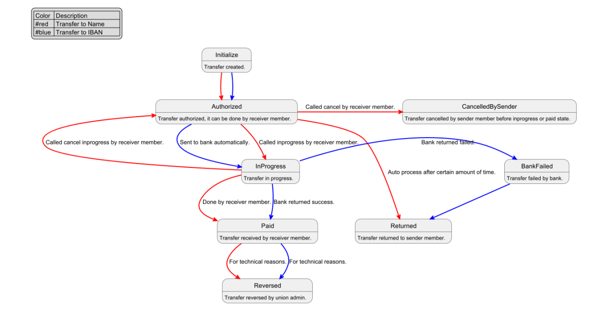
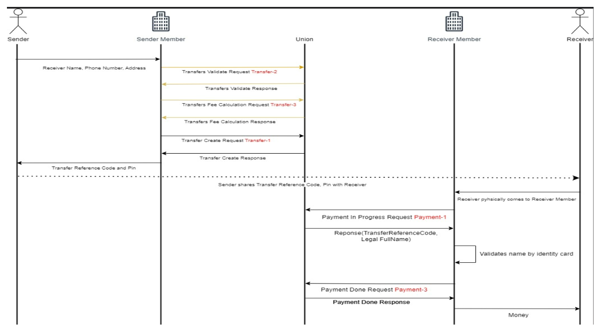
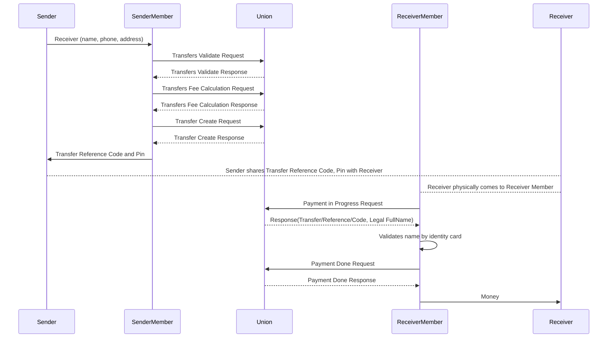
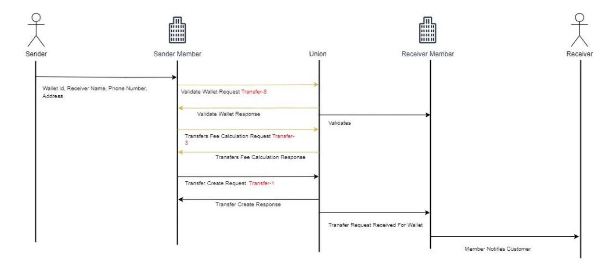
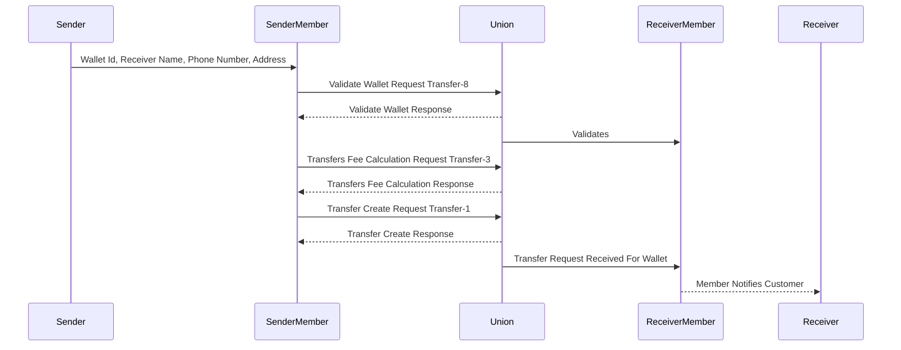
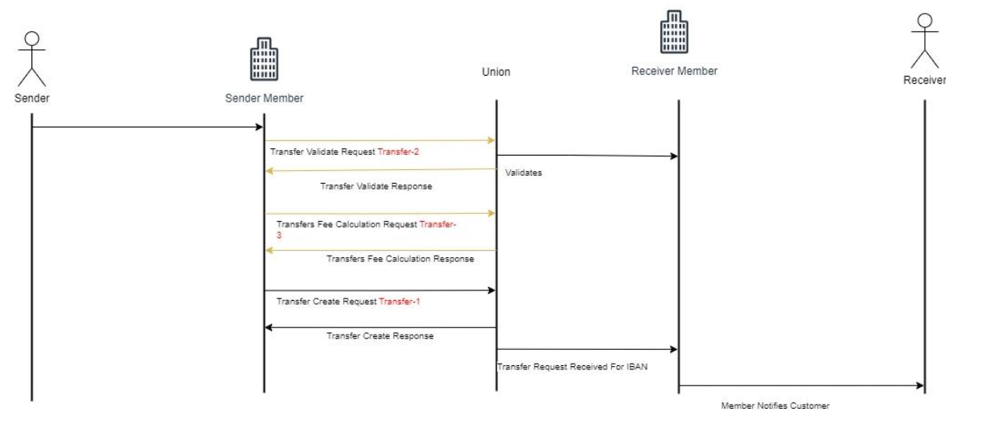
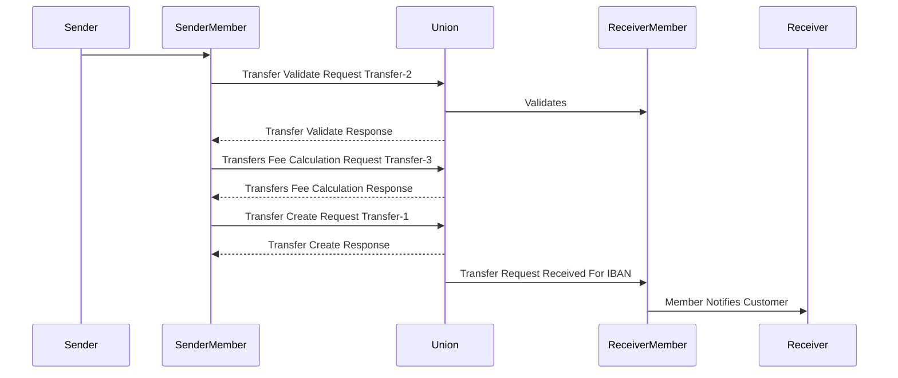

# Transaction Flows

## Overview
This document outlines the transaction flows for the Union API, detailing the steps involved in initiating, processing, and completing a money transfer.

The Transfer Services offered by Union that classified 3 categories:
- Transfer to Name
- Transfer to Wallet 
- Transfer to Iban 

## 1-Transfer To Name

This service enables the sender to instantly send money to the receiver’s name. The money is transferred to the receiver member. The receiver takes the money from the receiver member. A sender can initiate the money transfer by the sender member. 
Yellow arrows are used for optional services. 
In the given diagram, there are numbers on arrows that show the number of service’s sections. 

<!---->

## 2-Transfer To Wallet

This service enables the sender to instantly send money to a receiver’s wallet. The money is credited to a payment instrument associated with the receiver’s wallet. A sender can initiate the money transfer by the sender member.
Yellow arrows are used for optional services. 
In the given diagram, there are numbers on arrows that show the number of service’s sections.

<!--  -->

## 3-Transfer to IBAN

This service enables the sender to send money to a receiver’s bank account. The money is credited to the beneficiary's bank account. The sender can initiate the money transfer from cash over the counter. 
Yellow arrows are used for optional services. 
In the given diagram, there are numbers on arrows that show the number of service’s sections.

<!---->

